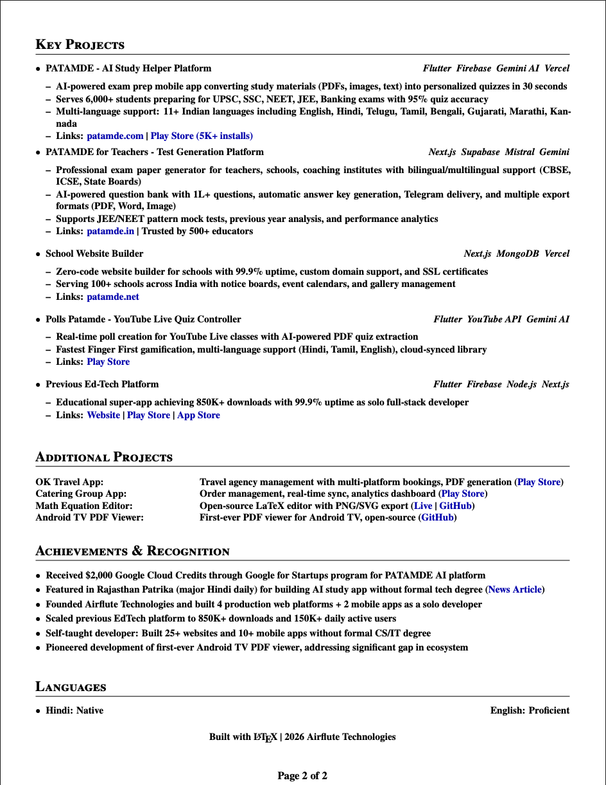
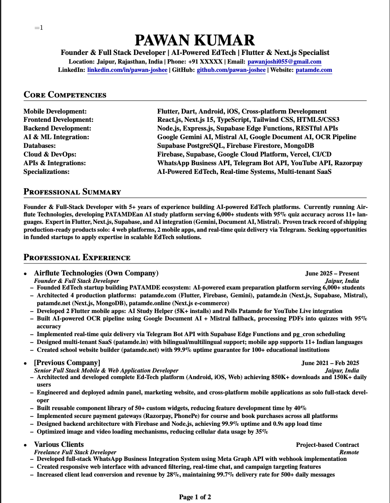

# 📄 ATS-Friendly Resume Generator with LaTeX & AI

Welcome to the **ATS-Friendly Resume Generator** repo!  
This tool empowers anyone to create a polished, professional resume in LaTeX—optimized for Applicant Tracking Systems (ATS)—using AI and Overleaf.

---

## 🚀 How It Works

**1. Prepare Your Resume**
- Find your old resume (PDF, DOCX, or text format).

**2. Use Copilot or ChatGPT to Convert to LaTeX**

- Open GitHub Copilot, ChatGPT, or any LLM interface.
- Directly upload or paste your resume file (PDF, DOCX, or text) into the chat.
- Use the following prompt:

```
copilot, please convert my resume (attached) into a modern, ATS-friendly LaTeX resume using the template from https://github.com/pawan-joshee/ats-latex-resume. Output only the LaTeX source file.
```

- If your LLM interface allows file attachments, simply upload your resume file. There’s no need for a public URL—modern LLMs can parse the attached file directly.

**3. Get Your LaTeX Resume Source**
- The AI will output a `.tex` file (LaTeX source).
- Copy the entire LaTeX code.

**4. Create Your Resume PDF with Overleaf**
- Go to [texviewer](https://texviewer.herokuapp.com/) .
- Paste the LaTeX code into `main.tex`.
- Click `View as PDF` to generate your PDF resume.

**5. Enhance and Customize!**
- Edit your resume directly in Overleaf to improve formatting, wording, or add additional details.
- Use Overleaf’s preview and version control to make iterations and get feedback.

---
...

## 🖼️ Sample Resume Output

Here is an example of an ATS-friendly resume generated using this method:




...

## 🔄 Alternative Approach: Using Libraries & Packages

Developers can automate the conversion or parsing of resumes into LaTeX format using libraries or packages:

- **Python:** [PyLaTeX](https://github.com/JelteF/PyLaTeX) for generating LaTeX code from structured data.
- **Node.js:** [latex.js](https://github.com/michael-brade/LaTeX.js) or [latex2js](https://github.com/latex2js/latex2js) for LaTeX parsing/generation.
- **Other languages:** Most languages have packages for LaTeX or PDF generation.

**Example:**  
Convert a JSON resume to LaTeX using Python:

```python
from pylatex import Document, Section
doc = Document()
with doc.create(Section('Professional Summary')):
    doc.append('Senior Full-Stack Developer with 4+ years...')
doc.generate_tex('resume_latex')
```

This approach is useful for:
- Batch conversion
- Integrating with resume databases/HR tools
- Automatic customization

Feel free to contribute scripts or examples!

---

## 🧠 Why Use This Method?

- **ATS-Friendly:** Machine-readable and parses perfectly in job applications.
- **Professional Look:** Elegant and customizable LaTeX templates.
- **Easy Conversion:** No LaTeX experience needed—AI does the heavy lifting.
- **Free Tools:** All steps use free tools (Copilot/ChatGPT and Overleaf).

---

## ✨ Tips for Better Results

- **Update your content:** Make sure your resume info is current and organized.
- **Iterate:** Edit in Overleaf for different job applications.
- **Keep it concise:** ATS systems prefer simple, well-structured sections.
- **Add links:** Insert LinkedIn, GitHub, Portfolio, etc.

---

## 📝 Example Prompt

```
copilot, here is my resume (attached PDF).  
Please convert it into an ATS-friendly LaTeX resume using the template at https://github.com/pawan-joshee/ats-latex-resume.  
Output only the LaTeX source file.
```

---

## 📂 Repository Contents

- `resume_latex.tex`: Sample LaTeX template to get you started.
- `README.md`: This guide.
- More templates and examples coming soon!

---

## 🤝 Contribute

Have suggestions or want to add more templates or scripts?  
Open a pull request or an issue!

---

## 📧 Contact

Questions or feedback?  
Reach out on [LinkedIn](https://linkedin.com/in/pawan-pareek) or [GitHub](https://github.com/pawan-joshee).

---

**Build your resume the modern way—ATS-friendly, elegant, and future-proof!**

